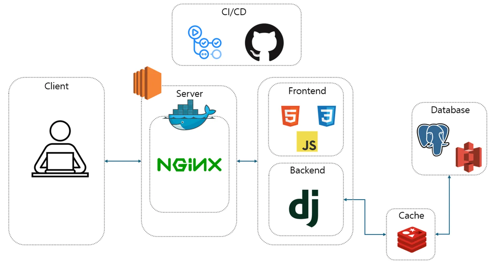
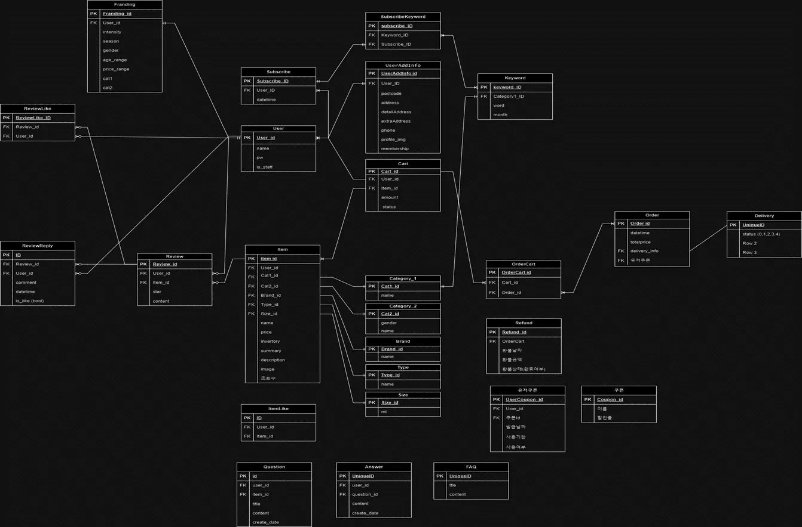
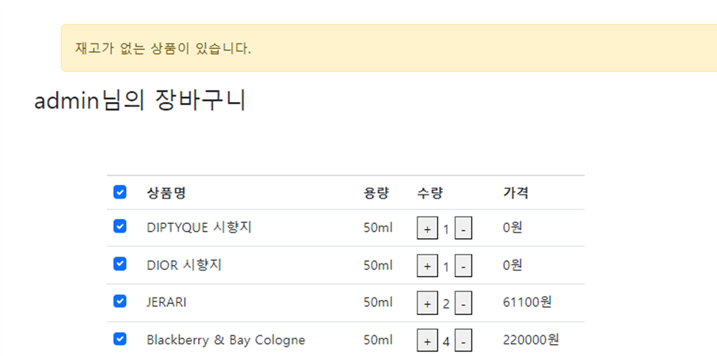
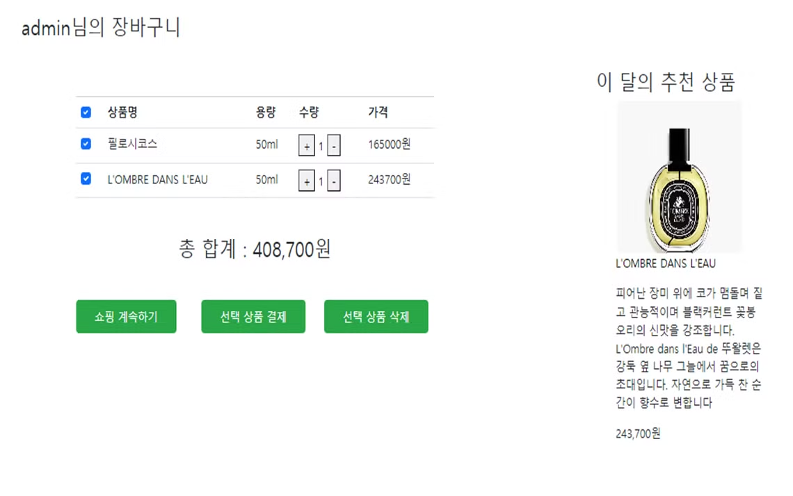
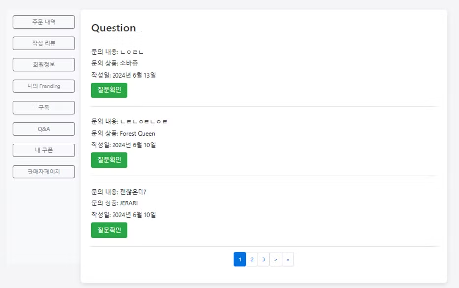
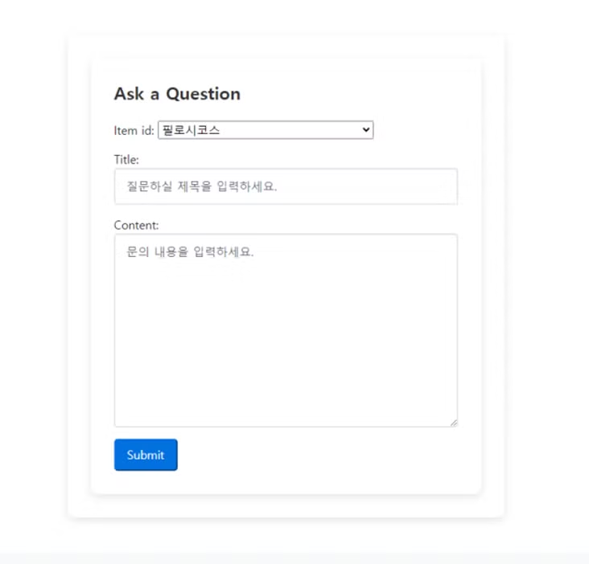
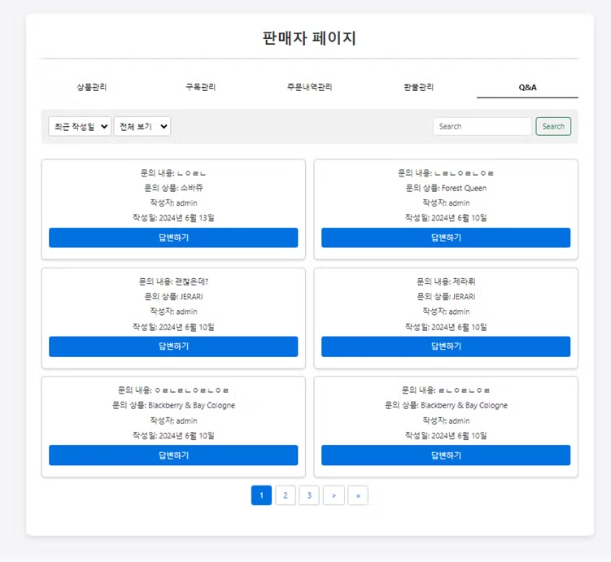
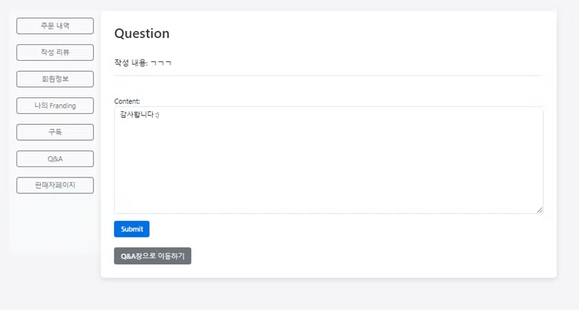

# franding
franding ( perfume e-commerce )
- 참여 인원 : 5명
- 프로젝트 기간 : 2024.04 ~ 2024.06
- [1차 ppt](https://docs.google.com/presentation/d/1CySDPxnNa83a4V2ppZaE6oWlMhOqoC59NOcgPnj-CbE/edit?usp=sharing)
- [2차 ppt](https://docs.google.com/presentation/d/1htPbCfCzKtB7ys21xPsmofA98Etv3MP1F0r96MqFcvg/edit?usp=sharing)


## 자신을 브랜딩하다

"자신을 브랜딩하다"는 개인의 브랜드 아이덴티티를 향수로 표현하는 Django 프로젝트입니다. 이 프로젝트는 사용자가 자신만의 향수를 선택하고, 이를 통해 자신을 브랜딩하는 과정을 돕습니다.

## 목차

- [프로젝트 개요](#프로젝트-개요)
- [개발 필요성](#개발-필요성)
- [아키텍처 설계](#아키텍처-설계)
- [데이터베이스 설계](#데이터베이스-설계)
- [화면 설계](#화면-설계)
- [구현 기능](#구현-기능)

## 프로젝트 개요

Franding은 '향수(Fragrance)'와 '브랜딩(Branding) yourself'의 결합으로 탄생한 혁신적인 이커머스 플랫폼입니다. 단순한 향수 쇼핑몰을 넘어, 개인의 정체성과 스타일을 향기로 표현하는 공간을 제공합니다. 우리는 다양한 세계 향수 브랜드와 협력해 독특한 향기 컬렉션을 선보이며, 향수를 통해 자신의 이야기를 전하는 경험을 제공합니다. Franding은 개성과 스타일을 반영한 맞춤형 향수를 찾아주는 추천 서비스를 제공하여, 향수를 자기 브랜딩의 중요한 도구로 활용할 수 있도록 돕습니다.

## 개발 필요성

- 향수의 대중화 : 향에 대한 어려운 정보 대신, 직관적인 이미지를 사용하고, 사용자 맞춤 향수 추천 서비스를 제공하여 향수 입문자들이 향수에 쉽게 다가갈 수 있도록 만들어 주는 서비스가 필요하다고 생각했습니다.
- 개인 브랜딩 : 개인 이미지 브랜딩을 위한 향수 선택의 폭을 제공하는 플랫폼이 필요하다고 생각했습니다.

## 아키텍처 설계


## 데이터베이스 설계


## 화면 설계
[1차 화면 설계](https://docs.google.com/presentation/d/17DuMx-zyVgrDCsx-ZuCPI8OtgU_Csh2_zeA4mnwuTFs/edit?usp=sharing)

[2차 화면 설계](https://www.figma.com/board/RHJVdE4kihHfqy3rwsGZu3/Untitled?node-id=0-1&t=p2ARZr5nDjnMj4zH-1)

## 구현 기능


### **프로젝트 경험: 장바구니 기능의 비동기 처리 구현**

장바구니 기능을 구현하는 과정에서, 상품 삭제 시 화면이 새로 고침되면서 **뒤로 가기 버튼을 눌러도 이전 페이지로 돌아가지 않는 문제**에 직면했습니다. 이는 사용자가 상품 삭제 후에도 이전 상태의 장바구니 화면을 한 번 더 보게 되는 문제를 초래했습니다.

이 문제를 해결하기 위해 **Ajax를 활용한 비동기 처리**를 도입하였습니다. 기존에는 동기적으로 요청을 처리하던 코드를 비동기적으로 전환하여, 화면이 새로 고침되지 않도록 했습니다. 이를 통해 사용자가 뒤로 가기 버튼을 눌렀을 때, 이전 페이지로 정상적으로 이동할 수 있게 되었으며, **사용자 편의성을 크게 향상**시킬 수 있었습니다.

이 과정에서 동기적 처리의 한계와 비동기적 처리의 장점을 깊이 이해하게 되었습니다. 특히, 사용자 경험을 최적화하기 위해 백엔드와 프론트엔드 간의 데이터 처리 방식이 어떻게 조율되어야 하는지를 깨닫게 되었습니다. 이러한 경험은 고성능 웹 애플리케이션 개발에서 중요한 요소인 비동기 처리 기술을 강화하는 데 큰 도움이 되었습니다.

---


### **프로젝트 경험: 장바구니 상품 수량 표시 기능 구현**

장바구니에 담긴 상품의 수량을 장바구니 아이콘에 실시간으로 표시해주는 기능을 개발하였습니다. 처음에는 상품 수량을 데이터베이스에 저장하고 페이지가 로드될 때마다 이를 불러오는 방식을 고려했으나, 데이터베이스 필드의 낭비를 최소화하기 위해 **수량 계산을 실시간으로 처리하여 템플릿에 넘겨주는 방식**을 선택했습니다.

그러나 이 접근 방식에서는 페이지 이동 시 수량이 사라지는 문제가 발생하였습니다. 이를 해결하기 위해 데이터베이스 대신 **로컬 스토리지**를 활용하여 수량을 저장하고 관리하도록 변경하였습니다. 로컬 스토리지는 간편하게 데이터를 저장, 호출, 삭제할 수 있어 적합한 선택이었습니다.

하지만, 서버에서 받아온 값을 로컬 스토리지에 저장한 후 페이지를 새로 고침할 때 값이 제대로 증가하지 않는 문제가 발생했습니다. 이 문제의 원인은 서버에서 수량을 연산하고 템플릿으로 전달하는 과정에서 발생한 **처리 시간의 지연**이었습니다. 이로 인해 새로 고침 후 값이 즉시 반영되지 않는 문제를 겪었습니다.

이 문제를 해결하기 위해 팀원들과 논의한 끝에, 수량 연산과 페이지 로드 간의 시간 차이를 줄여 동작을 안정화시키는 방법을 도입하였습니다. 이 과정에서 **성능 최적화와 비동기 처리의 중요성**을 깊이 깨닫게 되었습니다.

비록 이 문제로 인해 프로젝트 일정이 지연되었지만, 이 경험을 통해 **기능 완성도와 프로젝트 일정 간의 균형**이 얼마나 중요한지를 배우게 되었습니다. 또한, 더 나은 방법을 찾기 위해 고집을 부리는 것보다는 전체 프로젝트 일정과 팀의 협력을 우선시하는 것이 중요하다는 교훈을 얻었습니다.

---


### **프로젝트 경험: AI 기반 상품 추천 기능 구현**

저는 고객이 결제 시점에 사이트의 대표 상품을 홍보하기 위한 **AI 기반의 상품 추천 기능**을 구현하였습니다. 기존에는 가장 많이 구매한 상품을 추천하는 방식이었으나, 이를 더 정교하게 만들기 위해 **검색-증강 생성(RAG)** 방식을 도입하였습니다.

우선, 향수 데이터베이스에 저장된 모든 데이터를 **LLM(Large Language Model)**이 조회하도록 설정하였고, 이를 바탕으로 추천할 상품을 결정했습니다. 또한, 다양한 조건에 맞춰 **프롬프트**를 작성하여 고객에게 더 맞춤화된 추천이 이루어지도록 하였습니다. 예를 들어, 다음과 같은 프롬프트를 통해 여러 기준으로 상품을 추천하도록 했습니다:

- 데이터베이스에서 가장 많이 구매한 제품을 추천해주세요.
- 데이터베이스에서 별점이 높은 상품을 추천해주세요.
- 데이터베이스에서 가격이 높은 상품을 추천해주세요.
- 데이터베이스에서 리뷰가 좋은 제품을 추천해주세요.
- 상품을 3개 이상 추천해주세요.

이 기능을 개발하면서 **AI의 의사결정 과정에 대한 투명성**에 대해 고민하게 되었습니다. AI가 특정 상품을 추천할 때, 그 근거가 무엇인지, 어떤 정보가 반영되었고 어떤 정보가 제외되었는지를 명확히 이해하는 것이 중요하다는 것을 깨달았습니다. 이는 고객의 신뢰를 확보하고, 실제로 회사의 수익으로 이어지기 위한 필수적인 요소입니다.

이 프로젝트를 통해 AI를 활용한 추천 시스템이 단순한 기술 구현을 넘어, **데이터 수집 및 처리의 정확성**과 **비즈니스 성과**를 연결하는 중요한 역할을 한다는 것을 배웠습니다. 또한, 이러한 시스템의 설계와 구현에 있어 AI의 결과를 검증하고 최적화하는 과정의 중요성을 깨닫게 되었습니다. 앞으로도 이러한 경험을 바탕으로, 더 나은 추천 시스템을 개발하여 고객 만족도와 비즈니스 성과를 동시에 달성할 수 있는 솔루션을 제공하고자 합니다.

---



### **프로젝트 경험: Q&A 게시판 개발**

고객의 요청사항과 질문을 실시간으로 반영하기 위해 **Q&A 게시판**을 개발하였습니다. 고객이 상품 상세 페이지에서 문의하기 버튼을 누르면 문의 폼을 작성할 수 있고, 판매자가 이를 확인하여 답변을 제공할 수 있도록 기능을 구현했습니다. 또한, 고객은 자신의 질문 목록을 확인할 수 있으며, 답변이 달린 질문은 시각적으로 구분되도록 버튼 색상을 변경하여 표시했습니다.

하지만, 초기 개발 과정에서 **충분한 로직 설계 없이 코드를 작성**하다 보니, 코드가 복잡해지고 로직이 꼬여버리는 문제가 발생했습니다. 특히, 서로 다른 템플릿에서 데이터를 하나의 서버로 전송하고 요청하는 과정에서, 데이터는 제대로 전송되었으나 서버에서 응답이 오지 않는 오류를 겪었습니다. 이로 인해, 디버깅에 많은 시간을 소비하게 되었습니다.

이 문제를 해결하기 위해 강사님의 조언을 받아들여 **처음부터 로직을 재구성**하기로 했습니다. 기존의 복잡한 로직을 단순화하고, 직관적인 설계로 전환하였습니다. 구체적으로는:

- 고객이 질문을 작성하면 모든 질문을 보여주고, 특정 고객의 질문만 필터링할 수 있도록 구현했습니다.
- 각 질문에 대해 판매자의 답변을 명확하게 표시하고, 답변이 달린 질문은 시각적으로 구분되도록 하였습니다.
- 정렬 및 검색 기능을 고려하여 사용자 편의성을 높였습니다.

이 경험을 통해 **프로젝트 초기 단계에서의 충분한 설계의 중요성**을 깨닫게 되었습니다. 또한, 문제가 발생했을 때는 처음부터 로직을 다시 검토하여 단순화하는 것이 오히려 문제를 더 빠르게 해결할 수 있다는 교훈을 얻었습니다. 이 경험은 복잡한 시스템을 개발하는 과정에서 효율적인 문제 해결과 코드 관리 능력을 향상시키는 데 큰 도움이 되었습니다.

---



### **프로젝트 경험: Q&A 게시판 전용 검색 기능 구현**

고객이 올린 수많은 질문 중 특정 질문을 쉽게 찾을 수 있도록 하기 위해 **Q&A 게시판 전용 검색 기능**을 구현하였습니다. 기존의 정렬 기능만으로는 충분하지 않았고, 메인 검색란은 게시판 콘텐츠를 검색하는 데 적합하지 않아, 검색 전용 기능이 필요하다는 것을 인식하게 되었습니다.

이를 위해 **Vector DB를 이용한 자연어 검색 API**를 활용하였습니다. 먼저, 질문 데이터를 CSV 파일로 변환한 후, **HuggingFaceEmbeddings**를 사용하여 질문 제목을 벡터로 변환하였습니다. 이후 **Chroma**를 사용하여 벡터 저장소를 생성하고, 유사도 기반 검색 기능을 구현하였습니다. Chroma의 검색 메서드를 통해 사용자가 입력한 검색어와 질문 제목 간의 유사도를 계산하여, 가장 관련성이 높은 결과를 반환하도록 설계하였습니다.

그러나 구현 과정에서, **검색 대상이 되는 텍스트 값의 제한**이라는 문제에 직면하였습니다. 예를 들어, '삼남매'라는 도서 제목과 '과학'이라는 분류가 있을 때, 검색어로 '과학'을 입력하면 해당 키워드가 포함된 도서 제목을 반환하지 못하는 상황이 발생했습니다. 이를 해결하기 위해 **texts 값에 필요한 정보들을 결합**하여, 검색어가 다양한 필드를 포함한 텍스트와 비교될 수 있도록 수정하였습니다. 이를 통해, 더 정확하고 유연한 검색 결과를 제공할 수 있었습니다.

이 과정에서 **AI의 응답을 실용적으로 활용하기 위한 방법**에 대해 깊이 고민하게 되었습니다. AI의 결과가 아무리 정확해도, 서비스에 적용할 수 없다면 무의미하다는 점을 깨달았습니다. 최종적으로, 검색 결과를 id 값으로 필터링하여 가져올 수 있도록 texts에 id를 추가하였고, 검색 기능을 성공적으로 구현할 수 있었습니다.

이 경험을 통해, AI 기반 시스템을 실무에 적용할 때 **응답의 처리와 최적화 방법**에 대해 중요한 교훈을 얻었습니다.
```
from fastapi import FastAPI, HTTPException

import pandas as pd

from langchain_community.embeddings.sentence_transformer import SentenceTransformerEmbeddings

from langchain_chroma import Chroma

from langchain_huggingface import HuggingFaceEmbeddings

import uvicorn

# 데이터 로드

def load_data():

qna_csv = pd.read_csv('my_langchain/csv_file/QnA.csv')

return qna_csv

# 임베딩 모델 초기화

def init_model():

# sbert = SentenceTransformerEmbeddings(model_name='jhgan/ko-sroberta-multitask')

sbert = HuggingFaceEmbeddings(model_name='jhgan/ko-sroberta-multitask')

return sbert

# data_file()['title'].tolist()+data_file()['content'].tolist() 어떻게?

def vector_store_texts(data_file):

id = data_file()['id'].tolist()

title = data_file()['title'].tolist()

content = data_file()['content'].tolist()

created_at = data_file()['created_at'].tolist()

text_list = []

for i, x, y, z in zip(id, title, content, created_at):

str_i = str(i)

texts = str_i + ", " + x + ", " + y + ", " + z

text_list.append(texts)

return text_list

# 벡터 저장소 생성

def init_vector_store(data_file, sbert):

vector_store = Chroma.from_texts(

texts = vector_store_texts(data_file),

embedding=sbert(),

)

return vector_store

def search_question(query):

vector_store = init_vector_store(load_data, init_model)

results = vector_store.similarity_search(query=query, k=10)  # 상위 3개 결과 반환

return {"query": query, "results": results}
```

### **프로젝트 경험: AI 기반 추천 및 검색 기능의 성능 최적화**

AI를 이용한 추천 및 검색 기능을 개발하면서, 응답 시간이 길어지는 문제가 발생했습니다. 이를 해결하기 위해 **캐시를 활용한 성능 최적화** 방안을 고려하게 되었습니다. 응답 값을 캐시에 저장해 두었다가 동일한 요청이 들어오면 캐시에서 데이터를 반환하는 방식으로 속도를 향상시킬 수 있다고 판단했습니다.

처음에는 **Django의 기본 캐시 기능**을 사용하여 데이터를 메모리에 저장했습니다. 그러나 메모리에 데이터를 저장하는 방식의 문제점은 서버가 종료되면 캐시된 데이터가 모두 사라진다는 것이었습니다. 이 문제를 해결하기 위해 **Redis**를 도입하기로 결정했습니다. Redis는 서버가 꺼지더라도 데이터를 보존할 수 있는 인메모리 데이터 저장소로, 고속으로 데이터에 접근할 수 있다는 장점이 있습니다.

구현 과정에서는 **AWS EC2 인스턴스**를 사용하여 서버 환경을 설정하였습니다. Docker를 설치한 후, Redis를 설치하고 **Redis 컨테이너**를 생성하여 운영 환경에 통합했습니다. 이를 통해 캐시 데이터를 서버 종료 후에도 유지할 수 있게 되었으며, 결과적으로 추천 및 검색 기능의 응답 시간을 크게 단축할 수 있었습니다.

이 경험을 통해, **캐시 전략의 중요성**과 **인프라 설정의 효율성**을 깊이 이해하게 되었습니다. 특히, Redis와 같은 고성능 인메모리 데이터베이스를 활용하여 시스템의 성능을 극대화하는 방법을 배울 수 있었습니다.

---

### CI/CD
    ```bash
    # .github/workflows/deploy.yml
    name: Deploy Django to AWS EC2 with Git

    on:
    push:
        branches:
        - main

    jobs:
    deploy:
        runs-on: ubuntu-latest
        steps:
        - name: Checkout code
        uses: actions/checkout@v2

        - name: Setup SSH Keys
        uses: webfactory/ssh-agent@v0.9.0
        with:
            ssh-private-key: ${{ secrets.SSH_KEY }}

        - name: Sync and Deploy
        run: |
            ssh -o StrictHostKeyChecking=no ${{ secrets.USERNAME }}@${{ secrets.HOST }} "
            cd /home/ubuntu/franding
            git pull        
            sudo docker-compose down
            sudo docker-compose up -d --build
            "
    ``` 